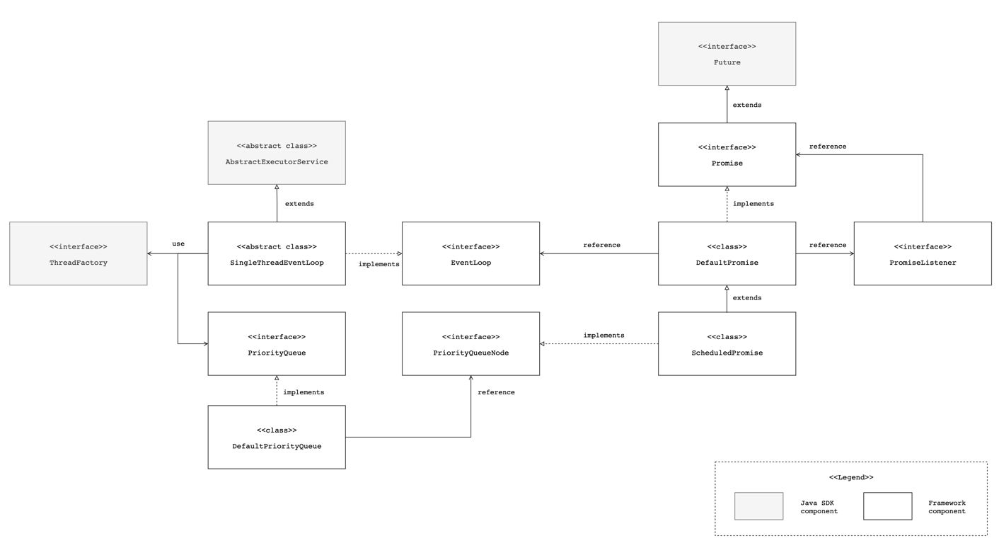

# Architecture

## Specifications

### interface: Promise\<V>

- boolean isSuccess()
- Promise\<V> addListener(listener)
- Promise\<V> removeListener(listener)
- Promise\<V> await(timeout, unit) throws InterruptedException
- Promise\<V> setSuccess(result)
- Promise\<V> setFailure(cause)

### class: DefaultPromise\<V>

### class: ScheduledPromise\<V>

### interface: PromiseListener

- void onComplete(Promise promise) throws Exception

### abstract class: SingleThreadEventLoop

- boolean inEventLoop()
- \<V> Promise\<V> newPromise()
- ScheduledPromise\<?> schedule(Runnable command, long delay, TimeUnit unit)