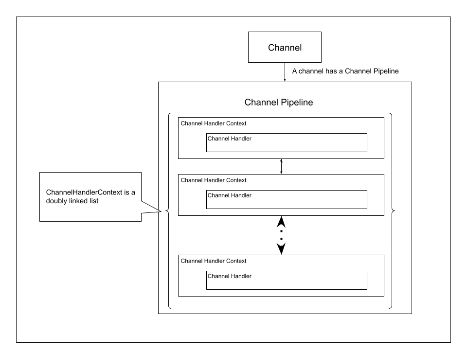

# Channel

A Channel is a class that abstracts an object that exchanges data with the outside like a TCP socket. In addition to TCP, it can support functions such as UDP sockets and Unix domain sockets.
In order to handle events that occur in Channel, el uses ChannelPipeline, ChannelHandlerContext, and ChannelHandler.

Each Channel has a ChannelPipeline. ChannelPipeline manages ChannelHandler functions, and calls the functions when events occur. ChannelPipeline uses ChannelHandlerContext to manage ChannelHandlers by creating an doubly linked list.

## ChannelPipeline

When a Channel receives an event(like receiving data from a network), it passes it to a ChannelPipeline. The ChannelPipeline calls the first handler. When each handler finishes handling the event, it calls the next handler.

If we send a message to a TCP channel, the invocation order of the handlers is reversed. 

---
TODO: Add an image that explains the order of invocation of handlers.
---

## ChannelHandler

A ChannelHandler is an event listener that listens events from a Channel. A ChannelHandler can listen all types of event from a Channel at a time. You can use the ChannelHandler to parse a message, to log the message, or to write business logic.

## ChannelHandlerContext

A ChannelHandlerContext is a wrapping class who is used by a ChannelPipeline to manage ChannelHandlers. 

## LocalChannel

A LocalChannel is a Channel that should be used only for test purpose. We can connect two LocalChannel in a process's memory. We cannot use the LocalChannel to communicate with other process or other machine.
