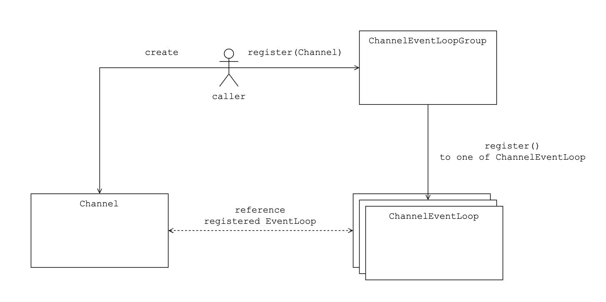

# EventLoopGroup

EventLoopGroup manages the list of EventLoops. Caller can get one of its EventLoop for itself to execute the task asynchronously. Or caller can submit task to execute to the EventLoopGroup. Which EventLoop will be choosed is dependent on EventLoopGroup choosing algorithm and the simplest way to choose is round-robin way and we support it.

## ChannelEventLoopGroup

ChannelEventLoopGroup extends EventLoopGroup and what functionality it extends is registering Channel to the EventLoop it manages. Caller can receives the promise which contains the result of registering the Channel to the EventLoop.

