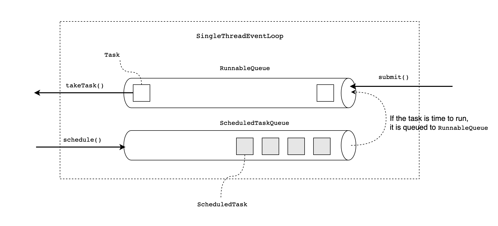

# EventLoop

A EventLoop represents the runner for running asynchronous computation. One of implementations is `SingleThreadEventLoop`. In the case of `SingleThreadEventLoop`, it manages its tasks using queues.

The client can use `SingleThreadEventLoop` APIs (`submit()`, `schedule()`) to request to run asynchronous task. Internally `SingleThreadEventLoop` manages several queues. One is `ScheduldTaskQueue`, when the client schedule the task to be run after some amount of time, `SingleThreadEventLoop` uses `ScheduldTaskQueue` to manage scheduled tasks. When the scheduled task is the time to be run, `SingleThreadEventLoop` place the task to the `RunnableQueue`, the second queue it manages. The tasks on the `RunnableQueue` now can be dequeue using `takeTask()`. The responsibility to run those retrieved tasks is on the client side.

