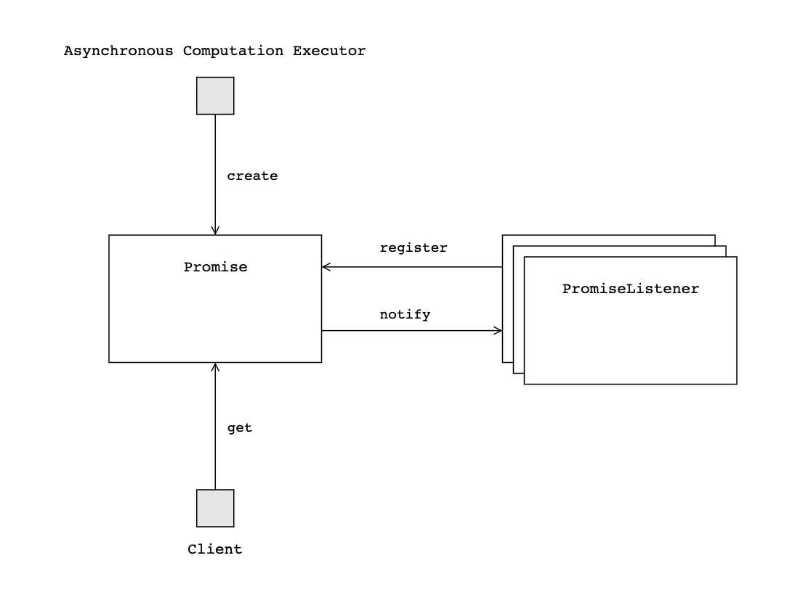

# Promise

A Promise is a placeholder for the result of asynchronous computation. One that runs asynchronous computation can return the Promise to the client for the result of request. On the client side, it can wait until Promise to be set result or the error.

A PromiseListener can be registered to the Promise, once it register, it can receive the Promise when it update its state.

